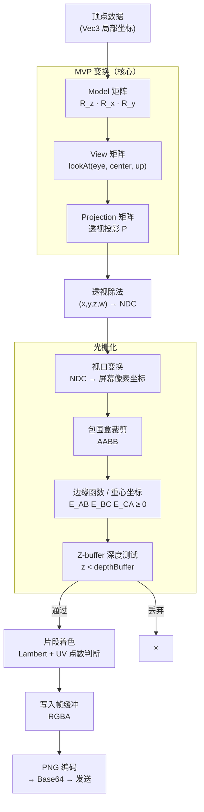

# koishi-plugin-dice-games101-3d-renderer 🎲

[](https://www.npmjs.com/package/koishi-plugin-games101-3d-renderer)

🎲 骰子：用TypeScript从零构建一个软件光栅化渲染器 🚀 

> 整活+学习项目，灵感来自闫令琪老师的 GAMES101 课程作业

> 没有 Three.js/WebGL，从矩阵乘法到PNG编码全部从头实现，零npm依赖

---

## 🎮 快速上手

```
dice                    # 随机角度摇一次骰子
dice 30 20 10           # 指定偏航 30°、俯仰 20°、翻滚 10°
```

敲回车后插件会实时渲染一个 400×400 的 3D 骰子图片发回来，同时告诉你渲染耗时和哪面朝上。

---

## 🗺️ 渲染管线总览



---

## 🗺️ 坐标系

```
         +Y (up)
          |     -Z (相机看的方向)
          |    /                ← 你在这儿，站在 (0, 0, 3)
          |   /
          |  /                  ← 看向原点 (0, 0, 0)
          | /
          |/__________ +X
         /
        +Z (相机背后)
```

- **摄像头** 站在 `(0, 0, 3)`，看向 `(0, 0, 0)` → 视线是 **-Z**
- **Up 方向** 是 **+Y**，**右侧** 是 **+X**

---

## 🔢 齐次坐标：为什么要用 4D？

3D 空间中的平移不是线性变换，无法用 3×3 矩阵表示。引入第四个分量 $w$ 后，平移可以统一为矩阵乘法：

$$
\begin{pmatrix}x'\\y'\\z'\\1\end{pmatrix}=
\begin{pmatrix}1&0&0&t_x\\0&1&0&t_y\\0&0&1&t_z\\0&0&0&1\end{pmatrix}
\begin{pmatrix}x\\y\\z\\1\end{pmatrix}
$$

这样，**平移、旋转、缩放、投影**都统一成 4×4 矩阵乘法，管线中所有变换可以预乘合并为一个矩阵。

> 规定：$w=1$ 表示点（位置），$w=0$ 表示向量（方向，不受平移影响）。

---

## 🎯 Yaw / Pitch / Roll：三个角度定姿态

```ts
// 旋转顺序：先偏航，再俯仰，最后翻滚
const model = Mat4.rotateZ(rl)
  .multiply(Mat4.rotateX(pt))
  .multiply(Mat4.rotateY(yw))
```

| 参数 | 中文 | 绕哪个轴 | 效果 |
|------|------|---------|------|
| `yaw` | 偏航 | Y 轴（上下轴） | 骰子左右转，像在转盘上 |
| `pitch` | 俯仰 | X 轴（左右轴） | 骰子前后翻，像在点头 |
| `roll` | 翻滚 | Z 轴（前后轴） | 骰子自旋，像在歪头 |

不给参数时自动用 LCG 随机生成：

```ts
const seed = Date.now()
const lcg = (s: number) => (Math.imul(s, 1664525) + 1013904223) >>> 0
const yw = yaw ?? lcg(seed) % 360
```

> LCG（线性同余生成器）是最简单的伪随机数算法，公式 $x_{n+1}=(ax_n+c)\mod m$，这里 $a=1664525$，$c=1013904223$，$m=2^{32}$。

---

## 📐 数学：MVP 变换

所有顶点依次经过三个变换：**Model → View → Projection**。

### Model 矩阵：三轴旋转

旋转顺序为 `R_z(roll) · R_x(pitch) · R_y(yaw)`，右乘表示先 yaw 后 pitch 再 roll（矩阵右结合）。

$$
R_y(\theta)=\begin{pmatrix}\cos\theta&0&\sin\theta&0\\0&1&0&0\\-\sin\theta&0&\cos\theta&0\\0&0&0&1\end{pmatrix}
\quad
R_x(\theta)=\begin{pmatrix}1&0&0&0\\0&\cos\theta&-\sin\theta&0\\0&\sin\theta&\cos\theta&0\\0&0&0&1\end{pmatrix}
$$

$$
R_z(\theta)=\begin{pmatrix}\cos\theta&-\sin\theta&0&0\\\sin\theta&\cos\theta&0&0\\0&0&1&0\\0&0&0&1\end{pmatrix}
\qquad
M_{\text{model}}=R_z\cdot R_x\cdot R_y
$$

旋转矩阵的列向量就是旋转后的坐标轴方向，且 $R^T=R^{-1}$（正交矩阵），这保证了旋转不改变向量长度。

**2D 旋转推导**（以 $R_z$ 为例）：单位向量 $\mathbf{e}_1=(1,0)$, $\mathbf{e}_2=(0,1)$ 旋转 $\theta$ 后落在：

$$
\mathbf{e}_1' = (\cos\theta,\;\sin\theta),\qquad
\mathbf{e}_2' = (-\sin\theta,\;\cos\theta)
$$

任意向量 $\mathbf{v}=x\mathbf{e}_1+y\mathbf{e}_2$ 旋转后展开：

$$
\mathbf{v}' = x\mathbf{e}_1'+y\mathbf{e}_2'
= \begin{pmatrix}\cos\theta&-\sin\theta\\\sin\theta&\cos\theta\end{pmatrix}\begin{pmatrix}x\\y\end{pmatrix}
$$

这正是 $R_z$ 的左上 $2\times2$ 子块。$R_x$、$R_y$ 同理，只是"旋转所在平面"不同。

```ts
const model = Mat4.rotateZ(rl).multiply(Mat4.rotateX(pt)).multiply(Mat4.rotateY(yw))
```

### View 矩阵：lookAt 推导

给定摄像机位置 $\mathbf{e}$（eye）、目标点 $\mathbf{c}$（center）、世界上方 $\mathbf{u}$（up），构建相机正交基：

$$
\hat{f}=\frac{\mathbf{c}-\mathbf{e}}{|\mathbf{c}-\mathbf{e}|},\quad
\hat{r}=\frac{\hat{f}\times\hat{u}}{|\hat{f}\times\hat{u}|},\quad
\hat{u}'=\hat{r}\times\hat{f}
$$

View 矩阵 = 旋转到相机空间 × 平移到原点（把相机挪到原点、摄像方向对齐 -Z）：

$$
V=\underbrace{\begin{pmatrix}
r_x & r_y & r_z & 0\\
u'_x & u'_y & u'_z & 0\\
-f_x & -f_y & -f_z & 0\\
0 & 0 & 0 & 1
\end{pmatrix}}_{\text{旋转基底}}
\cdot
\underbrace{\begin{pmatrix}
1&0&0&-e_x\\
0&1&0&-e_y\\
0&0&1&-e_z\\
0&0&0&1
\end{pmatrix}}_{\text{平移到原点}}
=\begin{pmatrix}
r_x & r_y & r_z & -\hat{r}\cdot\mathbf{e}\\
u'_x & u'_y & u'_z & -\hat{u}'\cdot\mathbf{e}\\
-f_x & -f_y & -f_z & \hat{f}\cdot\mathbf{e}\\
0 & 0 & 0 & 1
\end{pmatrix}
$$

> 注意前向轴取 $-\hat{f}$（右手坐标系，相机看向 $-Z$）。

```ts
const view = Mat4.lookAt(new Vec3(0,0,3), new Vec3(0,0,0), new Vec3(0,1,0))
```

### Projection 矩阵：透视投影推导

**视锥体参数**：竖直视角 $\text{fov}$，宽高比 $a$，近平面 $n$，远平面 $f$。

先求视锥体近平面的半高 $t$ 和半宽 $r$：

$$
t = n \cdot \tan\!\left(\frac{\text{fov}}{2}\right),\qquad r = a \cdot t
$$

透视投影矩阵的推导思路：将视锥体内的点压缩到 NDC 立方体 $[-1,1]^3$。
$X/Y$ 方向直接除以 $r/t$ 归一化；$Z$ 方向需要保留深度排序关系，同时把 $w=-z_\text{view}$（用于透视除法）：

$$
P=\begin{pmatrix}
\dfrac{n}{r} & 0 & 0 & 0\\[6pt]
0 & \dfrac{n}{t} & 0 & 0\\[6pt]
0 & 0 & \dfrac{-(f+n)}{f-n} & \dfrac{-2fn}{f-n}\\[6pt]
0 & 0 & -1 & 0
\end{pmatrix}
=\begin{pmatrix}
\dfrac{1}{a\cdot\tan(\text{fov}/2)} & 0 & 0 & 0\\[6pt]
0 & \dfrac{1}{\tan(\text{fov}/2)} & 0 & 0\\[6pt]
0 & 0 & \dfrac{-(f+n)}{f-n} & \dfrac{-2fn}{f-n}\\[6pt]
0 & 0 & -1 & 0
\end{pmatrix}
$$

**第 3 行推导**：要把 $z\in[-n,-f]$（视图空间，相机前方为负）映射到 NDC $[-1,+1]$，设映射为 $z_\text{NDC}=\frac{Az+B}{-z}$，代入边界条件：
- $z=-n \Rightarrow z_\text{NDC}=-1$
- $z=-f \Rightarrow z_\text{NDC}=+1$

解得 $A=\frac{-(f+n)}{f-n}$，$B=\frac{-2fn}{f-n}$。

```ts
const proj = Mat4.perspective(45, 1, 0.1, 100)
```

---

## 🔭 透视除法与视口变换

**透视除法**：Clip 坐标 $(x_c,y_c,z_c,w_c)$ 除以 $w_c$ 得到 NDC（Normalized Device Coordinates）：

$$
\mathbf{p}_{\text{NDC}}=\left(\frac{x_c}{w_c},\;\frac{y_c}{w_c},\;\frac{z_c}{w_c}\right)\in[-1,1]^3
$$

由投影矩阵最后一行，$w_c = -z_\text{view}$，即 $w_c > 0$（相机前方物体 $z_\text{view}<0$）。这一步实现了**近大远小**的视觉效果。

**视口变换**（NDC → 屏幕像素，Y 轴翻转因为屏幕 Y 轴向下）：

$$
x_s=\frac{x_{\text{NDC}}+1}{2}\cdot W,\qquad y_s=\frac{1-y_{\text{NDC}}}{2}\cdot H
$$

---

## 🔺 光栅化：边缘函数 + 重心坐标 + Z-buffer

### 边缘函数（Edge Function）

对屏幕三角形 $A,B,C$，定义三条边的边缘函数（叉积 $z$ 分量）：

$$
E_{AB}(P)=(B-A)\times(P-A),\quad
E_{BC}(P)=(C-B)\times(P-B),\quad
E_{CA}(P)=(A-C)\times(P-C)
$$

点 $P$ 在三角形**内部**当且仅当三个函数符号一致（同正或同负，取决于绕向）：

$$
P \in \triangle ABC \iff E_{AB}(P)\geq 0 \;\land\; E_{BC}(P)\geq 0 \;\land\; E_{CA}(P)\geq 0
$$

边缘函数还可以直接给出重心坐标：

$$
\alpha = \frac{E_{BC}(P)}{E_{BC}(A)},\quad
\beta  = \frac{E_{CA}(P)}{E_{CA}(B)},\quad
\gamma = \frac{E_{AB}(P)}{E_{AB}(C)}
\quad\Longrightarrow\quad \alpha+\beta+\gamma=1
$$

遍历策略：取包围盒（AABB）内所有像素，用边缘函数快速跳过外点，避免逐像素遍历全图。

### 透视校正插值

屏幕空间的 $(\alpha,\beta,\gamma)$ 是**经过透视失真**的，直接插值 UV 或法线会出错（近处拉伸）。

**为什么要校正**：透视投影后，属性在屏幕空间的插值**不再线性**。根本原因是透视除法引入了非线性（$w$ 随深度变化），直接插值 UV 或法线会在近处被拉伸。

**证明 $f/w$ 在屏幕空间线性**：设三角形顶点在裁剪空间的坐标为 $P_i$，对应属性 $f_i$，裁剪空间 $w$ 值为 $w_i = -z_{\text{view},i} > 0$。

3D 空间中 $f$ 是线性的，即 $f(\lambda) = \lambda_0 f_0 + \lambda_1 f_1 + \lambda_2 f_2$（$\lambda_i$ 为3D重心坐标）。

透视投影后，屏幕重心坐标 $(\alpha,\beta,\gamma)$ 与 3D 坐标 $(\lambda_i)$ 的关系为（可由相似三角形推导）：

$$
\lambda_i = \frac{\alpha_i / w_i}{\alpha_0/w_0 + \alpha_1/w_1 + \alpha_2/w_2}
$$

代入 $f$ 的线性插值：

$$
f_P = \sum_i \lambda_i f_i = \frac{\sum_i \alpha_i \cdot f_i/w_i}{\sum_i \alpha_i/w_i}
$$

其中 $\sum_i \alpha_i/w_i$ 在屏幕空间线性（$1/w$ 可直接用 $\alpha,\beta,\gamma$ 插值），故分子和分母都可先线性插值，再相除：

$$
f_P=\frac{\alpha\,\dfrac{f_0}{w_0}+\beta\,\dfrac{f_1}{w_1}+\gamma\,\dfrac{f_2}{w_2}}{\alpha\,\dfrac{1}{w_0}+\beta\,\dfrac{1}{w_1}+\gamma\,\dfrac{1}{w_2}}
$$

### Z-buffer 深度测试

插值得到的深度 $z_P$ 与缓冲区比较，通过则写入，否则丢弃（靠近相机的片段胜出）：

```ts
const zInterp = perspCorrect(z0, z1, z2, w0, w1, w2, α, β, γ)
if (zInterp < depthBuffer[x][y]) {
  depthBuffer[x][y] = zInterp
  // 写入颜色
  framebuffer[x][y] = shade(fragNormal, fragUV, baseColor)
}
```

---

## 💡 片段着色：Lambert 漫反射

**Lambert 光照模型**（漫反射 + 环境光）：

$$
L = k_a I_a + k_d \max(0,\;\hat{n}\cdot\hat{l})\cdot I_d
$$

| 符号 | 含义 |
|------|------|
| $k_a$ | 环境光系数（本项目取 0.15） |
| $k_d$ | 漫反射系数（本项目取 0.85） |
| $\hat{n}$ | 片段法线（须经法线矩阵变换，见下） |
| $\hat{l}$ | 指向光源的单位向量（`(1,1,1)` 归一化） |
| $I_a, I_d$ | 环境光/漫反射光强度 |

$\hat{n}\cdot\hat{l}$ 是入射角余弦——越正对光源越亮，背光面 $\leq 0$ 截断为 0（截断保证不出现负光）。

```ts
const lightDir = new Vec3(1, 1, 1).normalized()
const diff = Math.max(0, normal.dot(lightDir))
const color = baseColor * (0.15 + diff * 0.85)
```

### 扩展：完整 Blinn-Phong 模型（参考 C++ 实现）

本项目用简化 Lambert，完整的 Blinn-Phong 模型还包含**镜面高光**项，并引入**光源距离衰减**（平方反比定律）：

$$
L = L_a + \sum_{\text{lights}} \left(L_d + L_s\right)
$$

$$
L_a = k_a \cdot I_a
\qquad
L_d = k_d \cdot \frac{I}{r^2} \cdot \max\!\left(0,\; \hat{n}\cdot\hat{l}\right)
\qquad
L_s = k_s \cdot \frac{I}{r^2} \cdot \max\!\left(0,\; \hat{n}\cdot\hat{h}\right)^p
$$

其中：
- $r$ 为片段到光源的距离，$I/r^2$ 是**平方反比衰减**（物理准确）
- $\hat{h} = \text{normalize}(\hat{l}+\hat{v})$ 为**半角向量**（Blinn 近似，$\hat{v}$ 为视线方向）
- $p$ 为**高光指数**（shininess），越大高光越集中（本 C++ 实现取 $p=150$）
- $k_s$ 为镜面反射系数

**半角向量的几何意义**：$\hat{h}$ 是入射光 $\hat{l}$ 与视线 $\hat{v}$ 的角平分线。$\hat{n}\cdot\hat{h}$ 越大，说明法线越接近半角向量，即反射光越接近视线方向，高光越强。

对比原始 Phong（用 $\hat{r}\cdot\hat{v}$ 代替 $\hat{n}\cdot\hat{h}$，$\hat{r}$ 为反射向量）：

$$
\hat{r} = 2(\hat{n}\cdot\hat{l})\hat{n} - \hat{l}
$$

Blinn-Phong 用半角向量替代反射向量，计算量更小且效果接近，是实时渲染的标准选择。

```cpp
// C++ 实现（cpp_renderer_fork_from_games101_pa03）
Eigen::Vector3f half_dir = (light_dir + view_dir).normalized();      // 半角向量
Eigen::Vector3f Ld = kd.cwiseProduct(I_r2) * max(0, n.dot(l_dir));   // 漫反射
Eigen::Vector3f Ls = ks.cwiseProduct(I_r2) * pow(max(0, n.dot(h)), p); // 高光
```

### 法线变换矩阵：为什么用 $(M^{-1})^T$？

顶点用 $M$ 变换，法线**不能**直接用 $M$ 变换——若模型有非均匀缩放，直接用 $M$ 会导致法线不再垂直于表面。

**推导**：设切线向量 $\mathbf{t}$，法线 $\mathbf{n}$，满足 $\mathbf{n}^T\mathbf{t}=0$。
变换后切线 $\mathbf{t}'=M\mathbf{t}$，设法线变换矩阵为 $G$，要求 $(G\mathbf{n})^T(M\mathbf{t})=0$，即 $\mathbf{n}^T G^T M\mathbf{t}=0$。
要使此式对任意 $\mathbf{t}$ 成立，需 $G^T M = I$，即：

$$
G = (M^{-1})^T
$$

对纯旋转矩阵 $M=R$，由 $R^{-1}=R^T$ 可得 $G=R$，退化为直接用 $M$。本项目骰子只做旋转无缩放，所以法线可以直接经过 Model 矩阵旋转部分变换。

### 点数判断（UV 圆形测试）

每个顶点携带 UV 坐标 $(u,v)\in[0,1]^2$，经透视校正插值后与预设圆心 $(c_x,c_y)$ 比较：

$$
(u-c_x)^2+(v-c_y)^2 < r^2 \implies \text{涂黑（点）}
$$

```ts
const isDot = (uv.x - dotCenter.x) ** 2 + (uv.y - dotCenter.y) ** 2 < 0.09 ** 2
```

---

## 🎲 顶面判断

骰子有 6 个面，每个面有一个初始法线（旋转前）：

| 法线方向 | 点数 | 坐标轴颜色（`--axis`） | 备注 |
|---------|------|----------------------|------|
| `(0, 0, +1)` → +Z | 1 点 | 💙 蓝正轴 | 初始朝向相机 |
| `(0, 0, -1)` → -Z | 6 点 | 💙 蓝负轴 | 背面 |
| `(0, +1, 0)` → +Y | **2 点** | 💚 绿正轴 | 初始朝上 |
| `(0, -1, 0)` → -Y | 5 点 | 💚 绿负轴 | 底面 |
| `(+1, 0, 0)` → +X | 3 点 | ❤️ 红正轴 | 右面 |
| `(-1, 0, 0)` → -X | 4 点 | ❤️ 红负轴 | 左面 |

旋转后，把 6 个法线都通过 Model 矩阵的旋转部分转一遍，**Y 分量最大的面即当前顶面**：

$$
\text{top} = \arg\max_{i}\left(M_{[1,:]}\cdot \hat{n}_i\right)
= \arg\max_{i}\left(d_4\,n_x^{(i)}+d_5\,n_y^{(i)}+d_6\,n_z^{(i)}\right)
$$

其中 $M_{[1,:]}$ 是 Model 矩阵第 2 行（行主序 `d[4..6]`，对应 Y 轴变换方向）。

```ts
export function getTopFace(model: Mat4): number {
  const faces = [
    { nx: 0, ny: 0, nz: 1, value: 1 }, { nx: 0, ny: 0, nz: -1, value: 6 },
    { nx: 0, ny: 1, nz: 0, value: 2 }, { nx: 0, ny: -1, nz: 0, value: 5 },
    { nx: 1, ny: 0, nz: 0, value: 3 }, { nx: -1, ny: 0, nz: 0, value: 4 },
  ]
  const d = model.d
  let top = 1, maxY = -Infinity
  for (const f of faces) {
    const ty = d[4] * f.nx + d[5] * f.ny + d[6] * f.nz
    if (ty > maxY) { maxY = ty; top = f.value }
  }
  return top
}
```

---

## 🛠️ 配置

| 配置项 | 默认 | 说明 |
|--------|------|------|
| `showRenderInfo` | `true` | 显示渲染耗时、角度和顶面点数 |
| `enableQuote` | `true` | 是否引用触发消息 |

---

## 📁 项目结构

```
src/
├── index.ts / config.ts          # 插件入口 & 配置
├── command/command-dice.ts       # 指令解析（简单参数解析，略）
├── models/dice.ts                # 骰子几何 + 顶面检测
├── math/vec.ts & mat.ts          # Vec3/Vec4、Mat4（旋转、lookAt、透视、逆）
├── renderer/rasterizer.ts        # 光栅化（AABB、边缘函数、Z-buffer、透视校正插值）
│             shader.ts           # Lambert 着色 + UV 点数
└── image/png.ts                  # 纯手写 PNG（IHDR/IDAT/IEND/zlib/CRC，略）
```

---

## 📦 依赖

零图形库依赖。唯一外部依赖：Node.js 内置 `zlib`（PNG 压缩）+ Koishi 本体。

---

## 📚 参考

- [GAMES101 课程主页](https://sites.cs.ucsb.edu/~lingqi/teaching/games101.html)
- [闫令琪老师 B 站课程](https://www.bilibili.com/video/BV1X7411F744)
